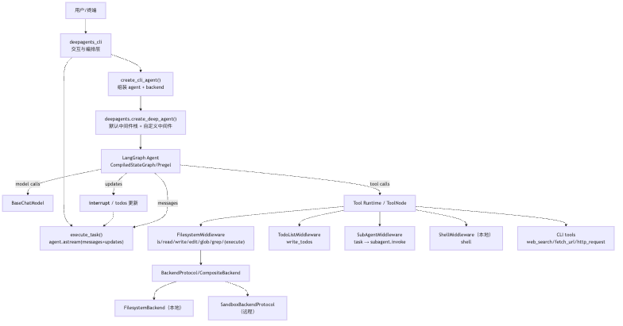
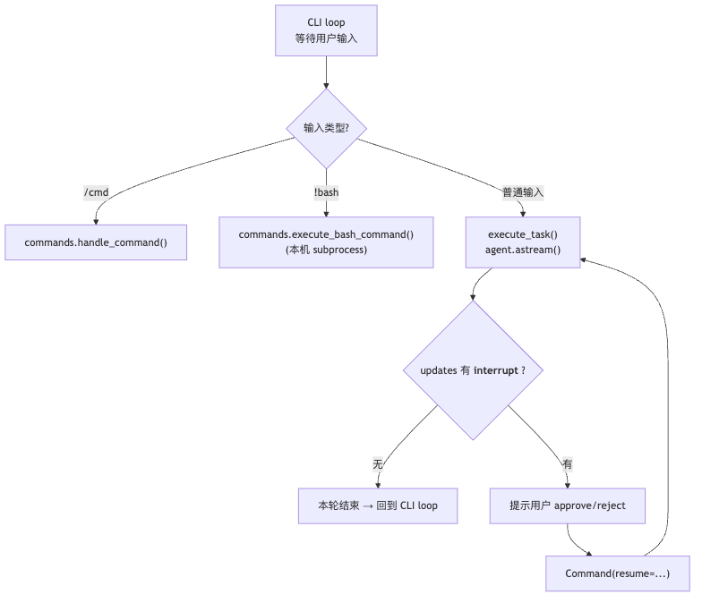
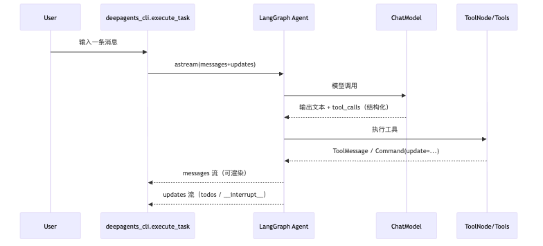
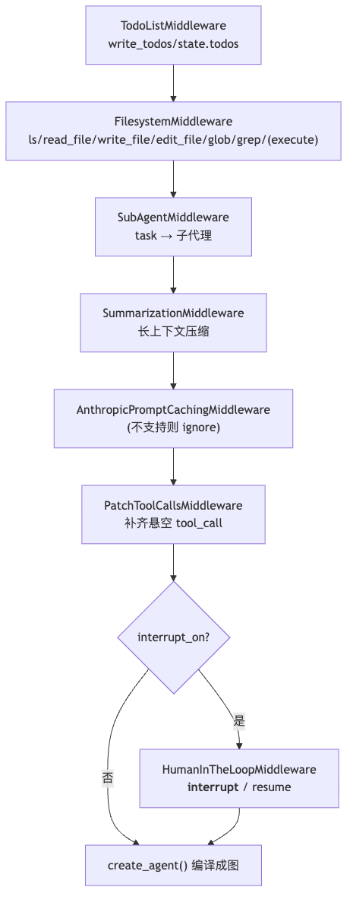
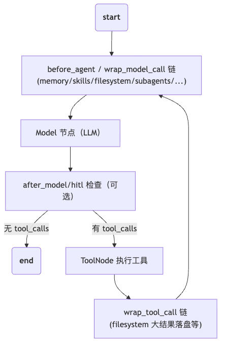
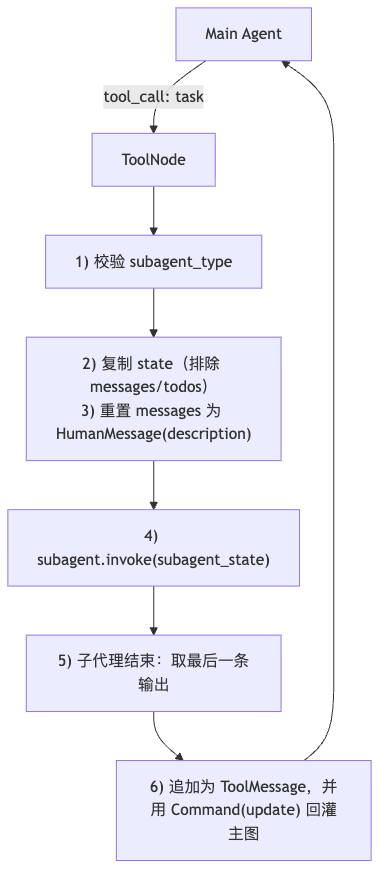
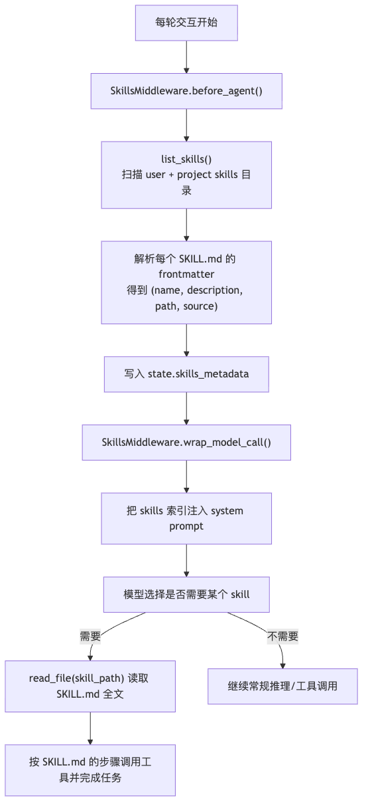
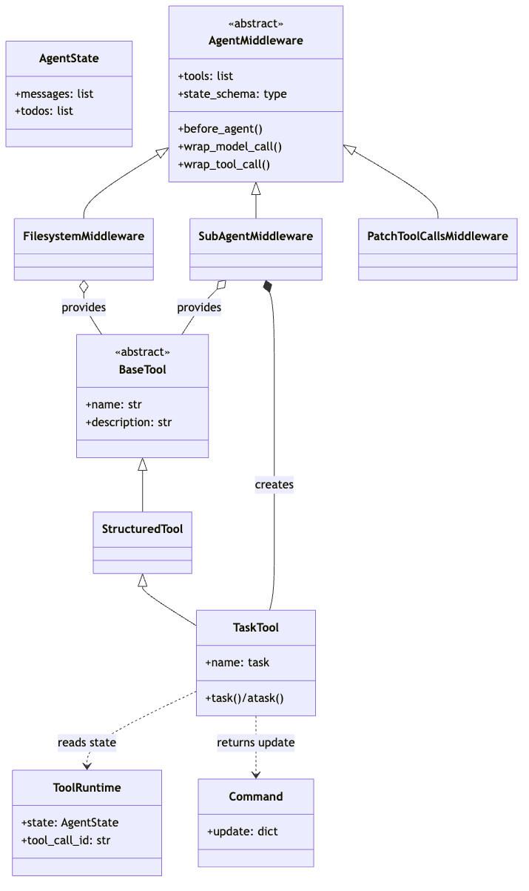

# DeepAgents 入门指南（从源码理解：Graph / Middleware / Tool / Agent）

> 目标：用“概念对齐 + 流程图 + 源码入口”把 deepagents（内核）与 deepagents-cli（终端）讲清楚，读完即可按图索骥改代码/加能力。  
> 本文依据：`docs/remark.md`、`docs/deepagents_cli_architecture_v2.md`、`libs/deepagents`、`libs/deepagents-cli`。

---

## 0. 先记住这 3 句话

1. **Agent 不是一段 while 循环**：在 deepagents 里，Agent 是一个 **编译后的 LangGraph 图（CompiledStateGraph / Pregel）**，可 `invoke/astream`。
2. **能力主要来自 Middleware**：文件系统、todo、子代理、摘要、HITL（人工确认）等都通过 **中间件栈**“叠加”到同一张图里。
3. **同一套工具语义，不同执行环境**：`FilesystemMiddleware` 提供一致的 file tools，但真正读写/执行由 **Backend** 决定（本地 `FilesystemBackend` 或远程 `SandboxBackendProtocol`）。

---

## 1. 两层架构：CLI 编排层 vs Agent 内核层

### 1.1 你在用的到底是哪一层？

- **deepagents（内核）**：`libs/deepagents/deepagents`  
  负责：`create_deep_agent()` 组装“模型 + 工具 + 中间件 + 状态”→ LangGraph 图。
- **deepagents-cli（编排/交互）**：`libs/deepagents-cli/deepagents_cli`  
  负责：终端输入、流式渲染、HITL 审批 UI、skills/memory 注入、（可选）远程沙箱生命周期。

### 1.2 总览图（建议先看这一张）




---

## 2. 读源码最快的 3 个入口（建议按这个顺序看）

1. **CLI 启动与输入循环**：`libs/deepagents-cli/deepagents_cli/main.py`（`cli_main()` → `main()` → `simple_cli()`）
2. **Agent 组装（模型/后端/中间件/HITL）**：`libs/deepagents-cli/deepagents_cli/agent.py`（`create_cli_agent()`）
3. **流式执行器（messages + updates / interrupt-resume）**：`libs/deepagents-cli/deepagents_cli/execution.py`（`execute_task()`）

---

## 3. LangGraph / LangChain 概念对齐（只讲对你读本项目有用的）

### 3.1 LangGraph：图 + State + Runtime

- **State（状态树）**：一次会话共享数据（至少有 `messages`、`todos`；还可能有 `files`、`user_memory`、`skills_metadata`…）。
- **CompiledStateGraph / Pregel**：把“节点/边/状态 schema”编译成可执行对象：
  - `invoke/ainvoke`：一次性跑完
  - `astream`：边跑边吐事件（CLI 就靠它做流式渲染）
- **checkpointer + thread_id**：多轮输入之间“记住状态”的关键（CLI 用 `InMemorySaver()` + `thread_id`）。

### 3.2 LangChain：消息、工具、tool calls

- **messages**：`HumanMessage/AIMessage/ToolMessage/...`（模型上下文的主线）。
- **Tool（工具）**：模型不会“直接执行”，只会产出 tool call；运行时执行后把结果作为 `ToolMessage`（或 `Command(update=...)`）写回 state。
- **ToolRuntime**：工具执行时能拿到当前 state 与 `tool_call_id`（例如子代理 `task` 工具会用它把结果回灌到主图）。

---

## 4. 一次交互怎么跑起来（从输入到输出）

### 4.1 两层循环：CLI loop vs Task loop




> 对照源码：`libs/deepagents-cli/deepagents_cli/execution.py` 里用 `while True` 循环处理 interrupt-resume。

### 4.2 双通道流：messages vs updates

CLI 用 `stream_mode=["messages","updates"]` 同时接两类事件：

- **messages**：文本流、tool call 流、`ToolMessage`（工具结果）
- **updates**：状态增量（例如 `todos`）与 `__interrupt__`（HITL 中断请求）




---

## 5. Agent 图内部长什么样（默认能力从哪来）

### 5.1 `create_deep_agent()` 的默认中间件栈（主代理）

源码入口：`libs/deepagents/deepagents/graph.py#create_deep_agent`




> 重要：`interrupt_on` 不为 `None` 才会加 HITL 中间件（CLI 中即使 `--auto-approve`，也会传空 dict，因此仍会创建 HITL，但不会触发中断）。

### 5.2 子代理（subagent）的默认栈

子代理由 `SubAgentMiddleware` 预构建（见 `libs/deepagents/deepagents/middleware/subagents.py`），默认包含：

- `TodoListMiddleware`
- `FilesystemMiddleware`
- `SummarizationMiddleware`
- `AnthropicPromptCachingMiddleware`
- `PatchToolCallsMiddleware`
- （可选）`HumanInTheLoopMiddleware`：当主代理配置了非空 `interrupt_on` 时，general-purpose 子代理会继承同一套审批策略

### 5.3 Graph 执行主循环（Model ↔ Tools）

（参考 `docs/remark.md` 的执行流程图，结合 CLI 默认中间件栈）




---

## 6. 关键组件（按“疑问主线”快速澄清）

### 6.1 LangGraph 是什么：工作流？节点？还是别的？

在本项目语境里，LangGraph 更像 **可运行的状态机/工作流引擎**：不断读写同一份 `State`，并允许 `astream` 把中间过程吐出来（CLI 才能“边跑边显示”）。

### 6.2 `create_cli_agent()`、`create_deep_agent()`、`create_agent()` 是什么关系？

```text
create_cli_agent()  (CLI: 选 backend + 追加 memory/skills/shell + interrupt_on)
  -> create_deep_agent() (内核: 默认中间件栈 + 可选 HITL)
    -> langchain.agents.create_agent() (底层: 把 model/tools/middleware 编译成 LangGraph 图)
```

对照源码：
- `libs/deepagents-cli/deepagents_cli/agent.py#create_cli_agent`
- `libs/deepagents/deepagents/graph.py#create_deep_agent`

### 6.3 为什么需要子代理（subagent）？

不是为了“更聪明”，而是为了 **隔离上下文与 token 压力**：

- 主线程：保持对话清晰、可解释、可控（尤其是 HITL）
- 子线程：把复杂且可独立完成的任务丢给 `task` 工具跑完，最后只回一条 `ToolMessage` 汇报

### 6.4 `task` 工具到底做了什么？

（参考 `docs/remark.md` 的 SubAgent 执行流程）




对照源码：`libs/deepagents/deepagents/middleware/subagents.py#_create_task_tool`

### 6.5 `/clear` 是重建图吗？

不是。CLI 只是把 `agent.checkpointer` 换成新的 `InMemorySaver()`，从而让旧 state 不可达；图对象本身仍复用。  
对照：`libs/deepagents-cli/deepagents_cli/commands.py`（以及 `agent.py` 默认 `checkpointer=InMemorySaver()`）。

---

## 7. Context（上下文）怎么组成：State + system prompt + 治理

### 7.1 system prompt 的拼接顺序（高频困惑点）

每次模型调用前，`system_prompt` 会被多层 middleware 叠加（wrap_model_call 链）：

1. CLI 基础 system prompt：`libs/deepagents-cli/deepagents_cli/agent.py#get_system_prompt`
2. 内核追加（示例）：
   - `FilesystemMiddleware.wrap_model_call()`：注入 filesystem/execute 规约，并按 backend 能力过滤 `execute` 工具
   - `SubAgentMiddleware.wrap_model_call()`：注入 task 工具使用说明
3. CLI 追加：
   - `AgentMemoryMiddleware.wrap_model_call()`：把 `<user_memory>/<project_memory>` 放到 system 顶部
   - `SkillsMiddleware.wrap_model_call()`：把 skills 索引追加到 system prompt

### 7.2 上下文治理：两类“溢出处理”

- **对话过长**：`SummarizationMiddleware` 会压缩 `messages`（触发阈值在 `libs/deepagents/deepagents/graph.py` 里按模型 profile 选择 fraction/tokens 策略）。
- **工具结果过大**：`FilesystemMiddleware` 会把超大 `ToolMessage` 落盘到 `/large_tool_results/<tool_call_id>`，并返回“分页读取提示”。  
  对照：`libs/deepagents/deepagents/middleware/filesystem.py#_process_large_message`

---

## 8. Backend（后端）为什么是关键抽象？

### 8.1 同一套 tools，不同落地

- **工具语义（由 middleware 定义）**：`ls/read_file/write_file/edit_file/glob/grep/(execute)`
- **实际落地（由 backend 实现）**：本机文件系统、远程沙箱、持久化 store、或组合路由

源码入口：
- 协议：`libs/deepagents/deepagents/backends/protocol.py`（`BackendProtocol` / `SandboxBackendProtocol`）
- 组合：`libs/deepagents/deepagents/backends/composite.py`（`CompositeBackend`）
- 本地：`libs/deepagents/deepagents/backends/filesystem.py`（`FilesystemBackend`）

### 8.2 本地模式 vs 沙箱模式：shell 与 execute 的区别

- **本地模式**（CLI 默认）：`ShellMiddleware` 提供 `shell`；`FilesystemMiddleware` 会过滤掉 `execute`（因为本地 backend 不支持 `SandboxBackendProtocol`）。
- **沙箱模式**：不启用 `shell`；保留 `execute`，命令在远程环境执行（并且通常更可控/可复现）。

---

## 9. Skills（技能系统：Progressive Disclosure）

> Skills 的定位：**“可发现的工作流/知识库”**，不是工具本身。  
> 你可以把 Skill 理解为：一份带元数据（name/description）的 `SKILL.md` + 可选脚本/资料文件。CLI 只把“索引”注入 system prompt；模型需要时再 `read_file` 读取全文并遵循步骤执行。

### 9.1 Skills 解决了什么问题？

- **可发现**：每轮都会把 `name + description + path` 列出来，模型能“知道有哪些技能可用”。
- **省 tokens**：不把所有技能全文塞进 system prompt；只在需要时按需读取（progressive disclosure）。
- **可团队共享**：把项目 skill 放在 `[project-root]/.deepagents/skills/`（可进版本控制），团队一致复用。

### 9.2 Skills 目录结构与覆盖规则

Skills 有两类来源（同名时 project 覆盖 user）：

```text
# 用户级（跨项目复用）
~/.deepagents/<agent>/skills/<skill_name>/SKILL.md

# 项目级（随仓库共享/覆盖用户同名技能）
<project_root>/.deepagents/skills/<skill_name>/SKILL.md
```

本仓库里：`.deepagents/skills` 是指向 `skills/` 的 symlink（因此你在 `skills/` 下新增/修改会直接影响项目技能加载）。

### 9.3 `SKILL.md` 格式（YAML frontmatter 必填）

`SKILL.md` 必须包含 YAML frontmatter，至少两项：`name`、`description`。

```markdown
---
name: web-research
description: Structured web research workflow (search → organize → synthesize)
---

# Web Research

## When to use
- ...
```

> 对照源码：`libs/deepagents-cli/deepagents_cli/skills/load.py#_parse_skill_metadata`

### 9.4 Skills 的运行时加载与注入流程（关键图）




对照源码：
- 注入与 state：`libs/deepagents-cli/deepagents_cli/skills/middleware.py`
- 扫描与安全：`libs/deepagents-cli/deepagents_cli/skills/load.py`

### 9.5 安全与限制（你会在这里踩坑）

- **安全检查**：skills 扫描会做 symlink 越权防护（resolve 后必须在 skills 目录内），并限制 `SKILL.md` 最大 10MB。
- **沙箱模式限制**：skills 的 `path` 是本机路径，但沙箱模式下 `read_file` 指向远程 backend，通常读不到本机技能文件；要在沙箱中使用，需要把 skills 同步/挂载到沙箱文件系统里。

### 9.6 如何验证 skills 是否生效（最省时间的做法）

- CLI 提供命令：`deepagents skills list`（会列出 user + project skills；同名时 project 覆盖 user）。
- 本地开发时，直接确认目录是否存在：`<project_root>/.deepagents/skills/`（本仓库为 symlink → `skills/`）。

### 9.7 创建一个新 skill（最小步骤）

1. 新建目录：`skills/<skill_name>/`
2. 新建文件：`skills/<skill_name>/SKILL.md`（包含 YAML frontmatter：`name`、`description`）
3. （可选）把脚本/参考资料放到同目录，供 skill 文档引用（模型会通过 `read_file` 读取，或用 `shell` 运行脚本）

> 经验：`description` 写得越“可触发”（明确适用场景、输出物、边界），模型越容易在合适的时候选中这个 skill。

---

## 10. 最小上手（两种使用方式）

### 10.1 用 CLI（交互式）

见 `libs/deepagents-cli/README.md`，常用方式：

```bash
# 安装后直接运行（或在仓库里用 Makefile/uvx 运行）
deepagents

# 自动批准所有工具调用（跳过 HITL）
deepagents --auto-approve

# 远程沙箱执行（provider 视环境配置）
deepagents --sandbox modal
```

### 10.2 用 Python API（库方式）

```python
from deepagents import create_deep_agent

agent = create_deep_agent(
    model="openai:gpt-4o",
    tools=[],
    system_prompt="你是一个严谨的工程助手。",
)

result = agent.invoke({"messages": [{"role": "user", "content": "解释一下 LangGraph 是什么"}]})
print(result["messages"][-1].content)
```

---

## 11. 扩展点清单（你想“改能力/加能力”应该看哪里）

| 你想做什么 | 建议入口 | 关键点 |
|---|---|---|
| 加一个新工具（tool） | `create_deep_agent(tools=[...])` 或 CLI `main.py` 加入 tools | 工具只定义语义；执行靠 runtime/backend |
| 加一个新中间件（middleware） | `create_deep_agent(middleware=[...])` | 可：注入 tools、改 system prompt、wrap tool/model call |
| 自定义子代理（subagents） | `create_deep_agent(subagents=[...])` | `task` 工具按 `subagent_type` 选择 |
| 切换/组合后端（backend） | `create_deep_agent(backend=...)` / `create_cli_agent()` | 本地/沙箱/持久化 store/路由 |
| 配置 HITL 审批哪些工具 | `interrupt_on={...}` | 中断通过 updates 的 `__interrupt__` 传到 CLI |

---

## 12. 常见“坑”（读源码时最容易卡住的点）

1. **Skills 在沙箱里可能读不到**：skills 路径是本机路径，但沙箱 backend 的 `read_file` 指向远程文件系统；要用需同步/挂载。
2. **Memory 不会自动热更新**：`AgentMemoryMiddleware.before_agent()` 仅在 state 缺失时加载（会话中途改文件不一定生效）。
3. **本地模式没有 `execute` 工具**：会被 `FilesystemMiddleware.wrap_model_call()` 过滤；本地执行用 `shell`。
4. **大工具结果的落盘路径**：`/large_tool_results/...` 在不同 backend 下语义不同；本地可能因权限写失败（会退化为不落盘）。

---

## 附录 A：Middleware / Tool / Task / Agent 类关系图（来自 `docs/remark.md` 思路）

> 目的：把“中间件如何注入 tools，以及 tool 如何回灌 state”用一张图连起来。




---

## 附录 B：Mermaid 渲染说明

如果你的 Markdown 预览不显示 Mermaid：

- GitHub：原生支持 Mermaid
- VS Code：需安装 Mermaid 预览扩展（如 “Markdown Preview Mermaid Support”）
