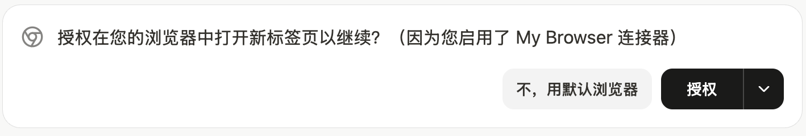
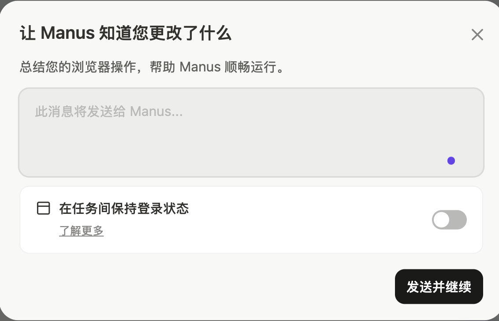
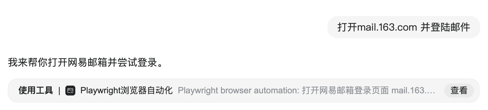
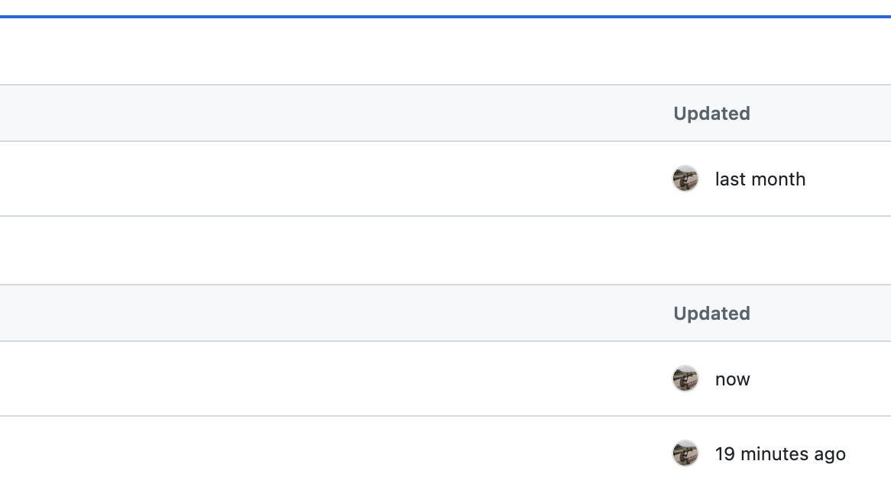

# manus

1. 先生成了md
2. md 转 pdf
3. md通过LLM生成html
4. 而pptx是另外生成的，不是html转pptx

## 技术方案: 每一页先生成了html,再通过工具内部转为pptx

- 其中一次看的结果
- 存在如下问题：
  1. 页面不统一，包括背景，配色
  2. 内容不统一，其实就量插入图片和文字，如图片的背景色
  3. 文本框内容不协调，包括字体的位置，溢出等

- 应该是html转pptx时效果无法保证
- 而html生成pdf时效果要好

```
ubuntu@sandbox:~ $ manus-export-slides manus-slides://kZdSk89cZLOYihfk3Nr2Jc pdf && manus-export-slides manus-slides://kZdSk89cZLOYihfk3Nr2Jc pptx
Starting conversion: manus-slides://kZdSk89cZLOYihfk3Nr2Jc -> PDF
Slides URI: manus-slides://kZdSk89cZLOYihfk3Nr2Jc
Version ID: kZdSk89cZLOYihfk3Nr2Jc
Export format: PDF
Output file: 2025-2026_A.pdf
Generated file: 2025-2026_A.pdf
Conversion completed
Starting conversion: manus-slides://kZdSk89cZLOYihfk3Nr2Jc -> PPTX
Slides URI: manus-slides://kZdSk89cZLOYihfk3Nr2Jc
Version ID: kZdSk89cZLOYihfk3Nr2Jc
Export format: PPTX
Output file: 2025-2026_A.pptx
```

## 打开浏览器

- 输入: 打开google首页，提示:
  + 首次，则提示
    
  + 启动My Browser连接器是manus内部逻辑，并不需要在用户手工启动
  + 点击安装，则安装Manus AI Browser Operator插件
  + 可不安装，使用manus虚拟机中的浏览器
  + 如果已安装，则提示授权，也可不授权，则使用默认虚拟机中的浏览器
    

- 如果授权，则在当前浏览器中打开一个标签页
- 不授权，则在manus虚拟机机中打开chrome
  + 若需要输入账户，则提示需要接管
    
  + 若需要输入密码，则提示强烈建议接管
  + 接管后，显示接管页面，下面可点击退出接管，并提示
    
  + 告知manus接管期间做了什么，如没有输入，则默认为继续
  + 当然也可不接管，则存在信息泄漏的不安全因素


- 搜索boss上最新的AI岗位信息
  + manus 打开了boss，但一直卡住
  + 滑动校验时一起显示加载中

# genspark

## 打开浏览器

- 输入: 打开sina.com.cn，则使用Playwright在genspark client 打开了一个标签页面
  +
- 打开过程中，会不停的截图并分析
- 打开后，等待一段时间就自动关闭了，实测，基本不可用
  

# 建议：

- 教育场景目前Playwright操作，主要服务于搜索，而不是打开浏览器

# DeepAgentsClient

- 一个页面对应一个DeepAgentsClient实例
- 总实例数 = 打开的页面数
- 成员变量sessionId, wsUrl只记录当前chat
- 历史chat会记录在成员chatHistory

# session

- 创建新页面时会生成session, 生成新对话时也会生成session
- 如果init 后并不发送消息，多次点击newChat，会产生多个孤立的session
  + 加了优化，如果当前会话是空白会话，则复用
- 一个sessionid对应一个wsUrl = ws/session.id
- 先简单的理解: 一个chat对应一个session

# runId

- 用户每发送一次消息对应一个runId

# task

- client 的runId对应服务端的run_id，对应一个执行task


# doubao 生成ppt流程

## 输入: 深度调研A股近期走势，生成精美的pptx

## 过程

- 了解现状, 做一些搜索
- 制定计划，md大纲文件
- 视觉效果, 图像生成，背景图和抽象概念图，图片搜索
- 收集素材和完善计划
- 开始写ppt，md->ppt，为每张pptx设计提示词

## ppt制作

- PPT 整体要求

  - 设计原则
    - 设计风格（主题，深色科技风，结果说明：需要封面、目录、过渡页和致谢页）
    - 全局一致性规范(页面大小，字体，边距，色彩)
    - 其他要求：丰富，可读

  - 分页设计方案
    - 每个页面有不同的定位：封面，目录，过渡页，内容页，致谢页
    - 不同类型的页面如何背景图:
      - 封面

        生成任务：生成一张 16:9 的图，深色科技风格，底色是深暗蓝色，画面上有抽象的金融数据图表和发光的线条，画面中间 2/3 区域要是干净无元素的。
      - 目录

        生成任务：生成一张 16:9 的图，深色科技风格，底色是深暗蓝色，画面左侧有垂直的、发光的几何线条作为装饰，画面整体保持简洁。

      - 过渡页使用相同的文生图prompt 

        生成任务：生成一张 16:9 的图，深色科技风格，底色是深暗蓝色，画面中央有一个发光的圆形或方形科技感图案，图案周围有光晕效果。

      - 内容页面

        + 各页面使用不同的文生图prompt，有些页面没有图
        + 如果当前页面内容较多，则不生成背景图，有数据则在右侧生成数据图


  - 具体执行
    - 分批生成图片
      + 先是背景图
      + 相似的图片请求组合在一起
      + 第一批请求包括: 封面、目录、章节过渡页以及 “宏观政策” 和 “资金面” 页面的背景

    - 使用字符串替换功能将生成的图片链接替换到占位符


# GenSpark

- 每页分别先生成html代码，可以看到每页的html内容

# pptxgen (通过pptxgenjs生成的)

- 当前使用这个方案
- 效果图 -> codex -> 生成模板 (包括template.js 和 data.json，最复杂的让gpt5.2做)
- inputs.md -> 选择模板 -> 拆分为 slide.json -> 转pptx -> 合并
- 优点是可控，可以不停的加模板
- 可以进一上的工程化

# html2pptx ()

# pptx (claude 原skill)

# sandbox (daytona)

- 远程执行通过 `--sandbox daytona` 启用，底层走 `DaytonaBackend` 调用 `sandbox.process.exec(command)` 执行命令字符串（非交互式 shell）。
- 系统类型在 CLI 提示中统一描述为 Linux sandbox，默认工作目录为 `/home/daytona`。
- 依赖保障不是自动的：代码里假设沙盒内有 `bash`、`python3`、`grep` 等基础命令（`BaseSandbox` 的文件操作依赖它们）。
- 需要的命令用 `--sandbox-setup` 在沙盒创建后一次性安装，避免执行中途因缺命令失败。

# sandbox (docker)

- 服务端以 docker 容器作为 sandbox 后端，镜像基于 ubuntu22.04，预装 python3/pip/uv/apt/vim/node。
- 每个 session 对应 `workspace/<session_id>/` 子目录；删除 session 时从容器 `/workspace` 同步回写到该目录。
- docker 实例采用预热池机制：默认保持 10 个空闲容器，空闲少于 2 自动补齐。
- 释放策略：仅在用户点击 Web 删除按钮时释放容器并回传数据，不在断开 ws 时自动释放。

# docker 启动时机

- deepagents_server.py启动的时候会通过lifespan注入DockerSandboxPool，用于生成10个容器
- 

## 结论

- 暂定用docker, 可控，免费，可提前装包，要留意速度和资源消耗
- daytona，好集成，系统有此选项，但要付费，提前装包等这些定制需求不了解


# 进度安排

- 暂不完善历史记录方面的切换逻辑，先验证docker sandbox 在文件处理方面的一致性


# 路由

create_agent:
  graph.add_conditional_edges("tools", _make_tools_to_model_edge)
  graph.add_conditional_edges(loop_exit_node, _make_model_to_tools_edge)

_make_model_to_tools_edge -> Send('tools')

# 20260122 讨论

## pptx的写作难题

1. 套模板, 内容受限于模板，没有深度
2. html转pptx，格式信息丢失严重，目前没有很好的转换工具
3. nano bonano 采用图片，信息省略，文本表达能力不够
4. 模块化生成，先打造基本单元(可能是页面)，保证这些基本单元是完美的。生成时逐步确认(需求确认--大纲确认--再生成) (dokie)


## sandbox

1. manus用的是firecracker, 付费，和别人合作E2B，有一半的团队人员在做这个
2. 默认用的是daytona, 有免费额度，不够自由
3. 暂选型为docker，免费，自由，容易上手，比较主流

## 多模型 + 工具

1. 主线tool_call 目前用 glm-4.7，限速，建议尝试用claude
2. 工具类用其他模型，比如文生图或者图片理解用qwen-image
3. 代码生成用glm4.7
4. 共识，agent场景下，主要的还是用claude，要尝试


## 如何稳定使用海外模型api

1. 暂定使用wildcard


# 20260126

1. 修改ui，颜色，字体，logo
2. 运行上传图片
3. 添加图片理解，图片生成
