# create_agent() 流程图与说明

下面是 `create_agent()` 的流程图（Mermaid），可直接在支持 Mermaid 的 Markdown 渲染器中查看。

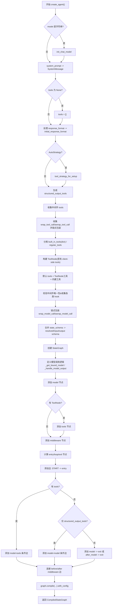

## 简单说明
- `model` 为字符串时先初始化为实际的聊天模型实例。
- `response_format` 会被解析为结构化输出策略，必要时创建结构化工具。
- 工具分为内建（dict）和客户端工具（ToolNode），并接入中间件的 tool wrapping。
- 中间件 hook 会被收集并串联，用于在模型调用前后插入逻辑。
- 最终构建 `StateGraph`，按条件边实现“模型↔工具”的循环，或无工具时直接结束。

## deepagents_cli 启动后的 graph 结构

以下图示基于当前 CLI 默认启动流程（本地模式、`auto_approve=False`）。

### 完整中间件栈

```
调用顺序: START → 中间件 → Model → 中间件 → ToolNode → 中间件 → Model → ...

┌─────────────────────────────────────────────────────────────────────────────┐
│                          CLI 特定中间件 (agent_middleware)                    │
├─────────────────────────────────────────────────────────────────────────────┤
│ 1. AgentMemoryMiddleware (enable_memory=True)                               │
│    ├─ before_agent: 加载 user_memory + project_memory                       │
│    └─ wrap_model_call: 注入记忆到 system_prompt                             │
│                                                                             │
│ 2. SkillsMiddleware (enable_skills=True)                                   │
│    ├─ before_agent: 发现并加载 skills_metadata                              │
│    └─ wrap_model_call: 注入 skills 文档到 system_prompt                     │
│                                                                             │
│ 3. ShellMiddleware (仅本地模式, enable_shell=True)                          │
│    └─ 提供 shell 工具 (无 hooks)                                            │
└─────────────────────────────────────────────────────────────────────────────┘
                                    │
                                    ▼
┌─────────────────────────────────────────────────────────────────────────────┐
│                        核心中间件栈 (deepagent_middleware)                    │
├─────────────────────────────────────────────────────────────────────────────┤
│ 4. TodoListMiddleware                                                       │
│    └─ 提供 write_todos, read_todos 工具 (无 hooks)                           │
│                                                                             │
│ 5. FilesystemMiddleware                                                     │
│    ├─ 提供 ls, read_file, write_file, edit_file, glob, grep, execute 工具   │
│    ├─ wrap_model_call: 添加 <env> 标签到 system_prompt                      │
│    └─ wrap_tool_call: 包装工具调用                                          │
│                                                                             │
│ 6. SubAgentMiddleware ⭐                                                     │
│    ├─ 提供 task 工具 (派生子代理)                                            │
│    └─ wrap_model_call: 注入 task 系统提示                                   │
│                                                                             │
│ 7. SummarizationMiddleware                                                  │
│    ├─ before_model: 检查是否需要摘要 (~170k tokens)                         │
│    └─ after_model: 摘要后截断消息                                           │
│                                                                             │
│ 8. AnthropicPromptCachingMiddleware                                         │
│    └─ wrap_model_call: 启用系统提示缓存 (Anthropic 专用)                    │
│                                                                             │
│ 9. PatchToolCallsMiddleware                                                 │
│    └─ before_agent: 修复中断后悬空的工具调用                                │
│                                                                             │
│ 10. HumanInTheLoopMiddleware (auto_approve=False 时添加)                    │
│     ├─ after_model: 检查是否需要人工确认 (interrupt_on 工具)                │
│     └─ before_model: 用户确认后继续                                         │
└─────────────────────────────────────────────────────────────────────────────┘
```

### Graph 执行流程图

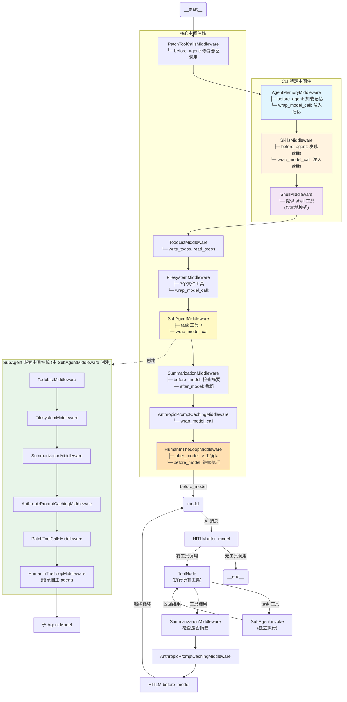

### 调用时机说明

| 中间件 | Hook 类型 | 调用时机 | 说明 |
|--------|-----------|----------|------|
| **AgentMemoryMiddleware** | `before_agent` | Agent 启动时 | 加载 user_memory 和 project_memory |
| | `wrap_model_call` | 每次 Model 调用前 | 注入记忆到 system_prompt |
| **SkillsMiddleware** | `before_agent` | Agent 启动时 | 发现并列出可用 skills |
| | `wrap_model_call` | 每次 Model 调用前 | 注入 skills 文档到 system_prompt |
| **PatchToolCallsMiddleware** | `before_agent` | Agent 启动时 | 修复中断后悬空的 tool calls |
| **ShellMiddleware** | - | - | 提供 shell 工具，无 hooks |
| **TodoListMiddleware** | - | - | 提供 write_todos/read_todos，无 hooks |
| **FilesystemMiddleware** | `wrap_model_call` | 每次 Model 调用前 | 添加 `<env>` 标签到提示 |
| | `wrap_tool_call` | 工具调用时 | 包装文件操作 |
| **SubAgentMiddleware** | `wrap_model_call` | 每次 Model 调用前 | 注入 task 工具使用说明 |
| **SummarizationMiddleware** | `before_model` | Model 调用前 | 检查 token 数，决定是否摘要 |
| | `after_model` | Model 返回后 | 若已摘要，截断消息历史 |
| **AnthropicPromptCachingMiddleware** | `wrap_model_call` | 每次 Model 调用前 | 启用系统提示缓存 |
| **HumanInTheLoopMiddleware** | `after_model` | Model 返回后 | 检查 interrupt_on 工具，需确认时暂停 |
| | `before_model` | Model 调用前 | 用户确认后继续执行 |

### SubAgent 执行流程

当 Model 调用 `task` 工具时：

```
Main Agent
    │
    ├── Model 决定调用 task(description="...", subagent_type="general-purpose")
    │
    ▼
ToolNode 执行 task 工具
    │
    ├── 1. 验证 subagent_type 是否存在
    ├── 2. 过滤状态 (排除 messages, todos)
    ├── 3. 创建新状态: {messages: [HumanMessage(description)]}
    │
    ▼
SubAgent.invoke(subagent_state)  ← 独立执行，完整 middleware 栈
    │
    │   SubAgent 内部中间件栈:
    │   ├── TodoListMiddleware
    │   ├── FilesystemMiddleware
    │   ├── SummarizationMiddleware
    │   ├── AnthropicPromptCachingMiddleware
    │   ├── PatchToolCallsMiddleware
    │   └── HumanInTheLoopMiddleware (继承自主 agent)
    │
    ▼
SubAgent 完成任务 → 返回 {messages: [...], ...}
    │
    ▼
_return_command_with_state_update
    │
    └── Command(update={messages: [ToolMessage(result)]})
    │
    ▼
Main Agent 收到 ToolMessage → 继续推理
```

## create_deep_agent() 中间件栈结构

以下是基于 `libs/deepagents/deepagents/graph.py:111-160` 的 `deepagent_middleware` 栈结构图：

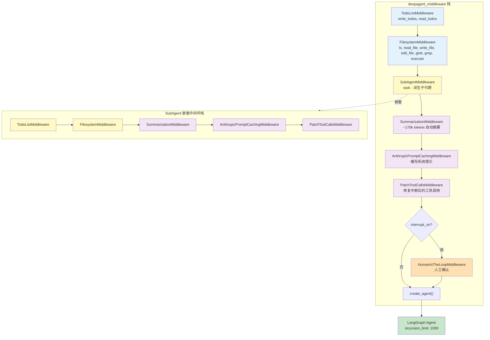

**说明：**
- 主中间件栈按顺序依次处理请求
- `SubAgentMiddleware` 内部嵌套了完整的子中间件栈
- 可选的 `middleware` 参数会追加到栈末尾
- 配置 `interrupt_on` 时会添加 `HumanInTheLoopMiddleware`


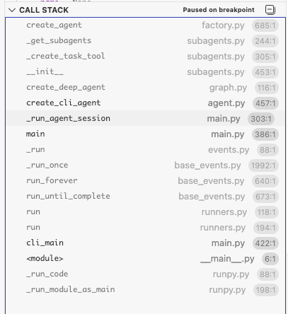 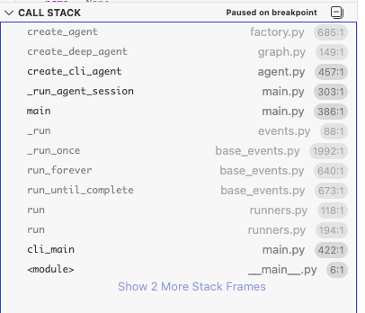


---

# Middleware、Tool、Task、Agent 类图

以下是基于源码分析的 DeepAgents 核心类关系图：

## 类图 (Mermaid)

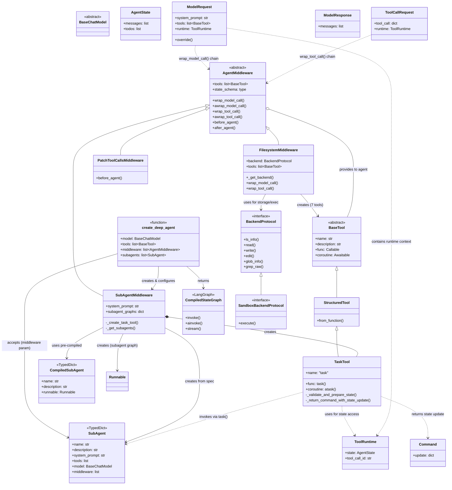

## 关键关系说明

### 1. 中间件继承关系
```
AgentMiddleware (抽象基类)
    ├── SubAgentMiddleware (提供 task 工具)
    ├── FilesystemMiddleware (提供 7 个文件系统工具)
    └── PatchToolCallsMiddleware (修复悬空工具调用)
```

### 2. 工具创建关系
| Middleware | 创建的工具 |
|-----------|----------|
| `SubAgentMiddleware` | `task` (调用 subagent) |
| `FilesystemMiddleware` | `ls`, `read_file`, `write_file`, `edit_file`, `glob`, `grep`, `execute` |

### 3. 数据流向
```
create_deep_agent()
    │
    ├── 接收: tools, middleware, subagents
    │
    ├── 构建 middleware stack
    │   ├── TodoListMiddleware
    │   ├── FilesystemMiddleware ──→ 7 个文件工具
    │   ├── SubAgentMiddleware ──→ task 工具
    │   ├── SummarizationMiddleware
    │   └── PatchToolCallsMiddleware
    │
    └── 返回: CompiledStateGraph (Agent)
```

### 4. Task 调用流程
```
Main Agent
    │
    ├── 调用: task(description, subagent_type)
    │
    ↓
TaskTool (SubAgentMiddleware 提供)
    │
    ├── _validate_and_prepare_state() ──→ 过滤状态
    │
    ↓
SubAgent.invoke(state) ──→ 独立执行
    │
    ↓
_return_command_with_state_update()
    │
    └── 返回 Command(update={messages, ...}) ──→ ToolMessage → Main Agent
```

## 核心设计模式

1. **Middleware Pattern** - 通过中间件栈注入功能
2. **Factory Pattern** - `_create_task_tool()`, `_get_subagents()` 等工厂函数
3. **Strategy Pattern** - 不同 `BackendProtocol` 实现可插拔
4. **Chain of Responsibility** - Middleware 按顺序处理请求/响应


## 运行流程

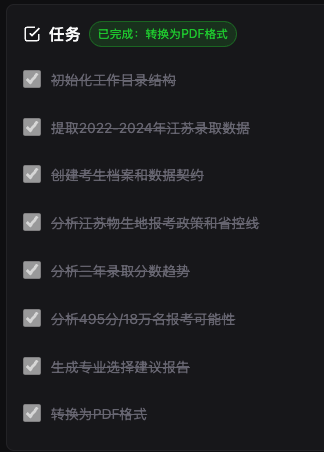


### 启动状态

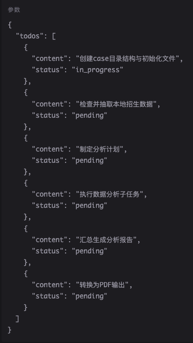 


### 完成 创建case目录结构与初始化文件

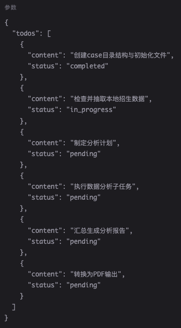

### 完成 检查并抽取本地招生数据

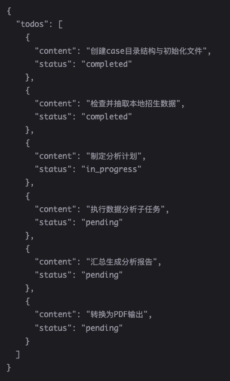


### 开始 制定分析计划

#### 写子任务的todos

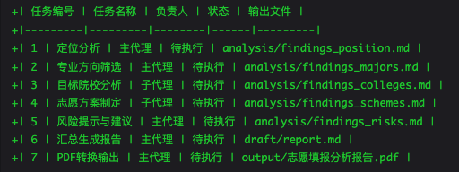

#### 生成 task-tool

#### 开始处理子任务

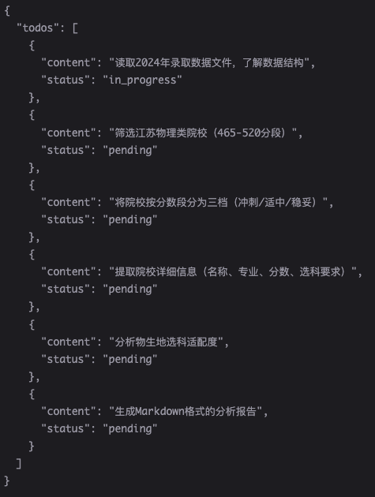


#### 完成 
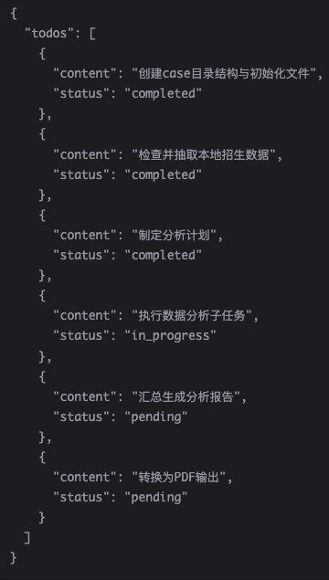


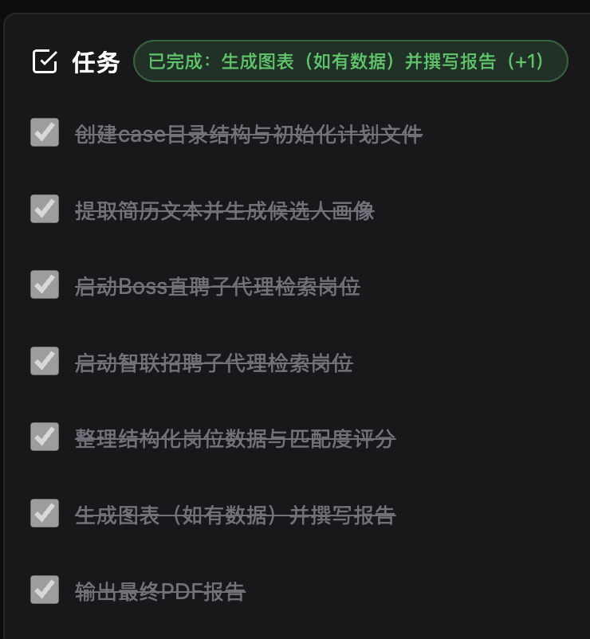