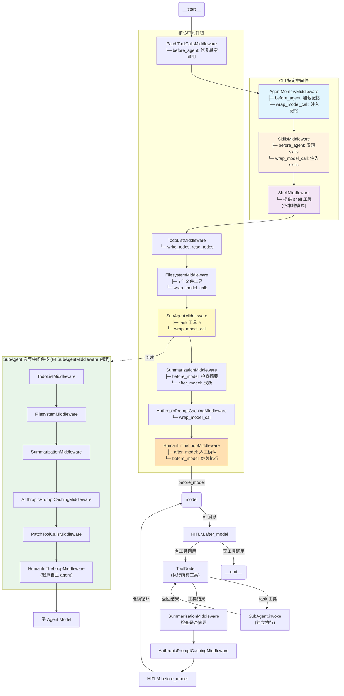
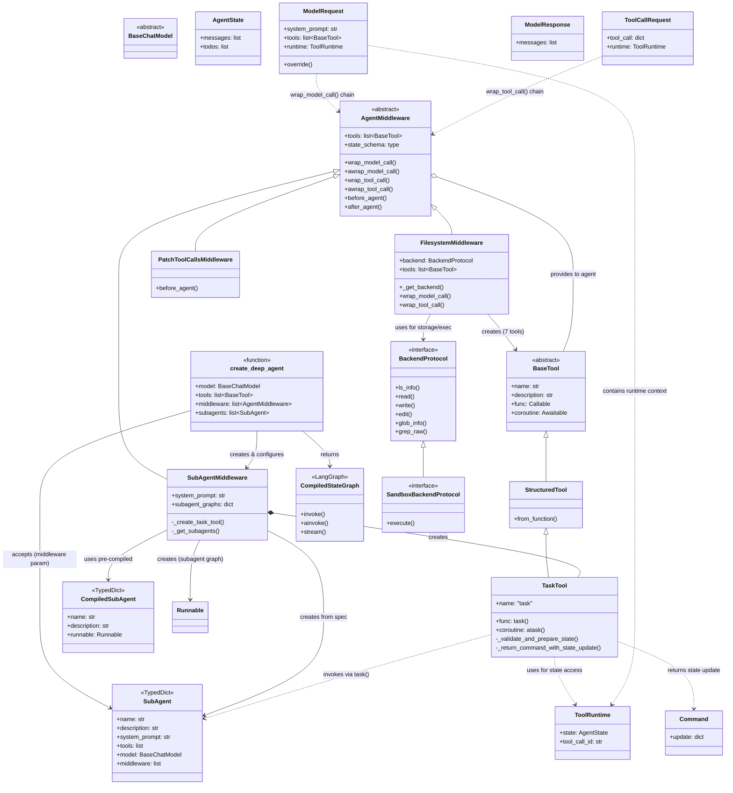

### Graph 执行流程图



### 调用时机说明

| 中间件                                     | Hook 类型           | 调用时机          | 说明                                  |
| ------------------------------------------ | ------------------- | ----------------- | ------------------------------------- |
| **AgentMemoryMiddleware**            | `before_agent`    | Agent 启动时      | 加载 user_memory 和 project_memory    |
|                                            | `wrap_model_call` | 每次 Model 调用前 | 注入记忆到 system_prompt              |
| **SkillsMiddleware**                 | `before_agent`    | Agent 启动时      | 发现并列出可用 skills                 |
|                                            | `wrap_model_call` | 每次 Model 调用前 | 注入 skills 文档到 system_prompt      |
| **PatchToolCallsMiddleware**         | `before_agent`    | Agent 启动时      | 修复中断后悬空的 tool calls           |
| **ShellMiddleware**                  | -                   | -                 | 提供 shell 工具，无 hooks             |
| **TodoListMiddleware**               | -                   | -                 | 提供 write_todos/read_todos，无 hooks |
| **FilesystemMiddleware**             | `wrap_model_call` | 每次 Model 调用前 | 添加 `<env>` 标签到提示             |
|                                            | `wrap_tool_call`  | 工具调用时        | 包装文件操作                          |
| **SubAgentMiddleware**               | `wrap_model_call` | 每次 Model 调用前 | 注入 task 工具使用说明                |
| **SummarizationMiddleware**          | `before_model`    | Model 调用前      | 检查 token 数，决定是否摘要           |
|                                            | `after_model`     | Model 返回后      | 若已摘要，截断消息历史                |
| **AnthropicPromptCachingMiddleware** | `wrap_model_call` | 每次 Model 调用前 | 启用系统提示缓存                      |
| **HumanInTheLoopMiddleware**         | `after_model`     | Model 返回后      | 检查 interrupt_on 工具，需确认时暂停  |
|                                            | `before_model`    | Model 调用前      | 用户确认后继续执行                    |

### SubAgent 执行流程

当 Model 调用 `task` 工具时：

```
Main Agent
    │
    ├── Model 决定调用 task(description="...", subagent_type="general-purpose")
    │
    ▼
ToolNode 执行 task 工具
    │
    ├── 1. 验证 subagent_type 是否存在
    ├── 2. 过滤状态 (排除 messages, todos)
    ├── 3. 创建新状态: {messages: [HumanMessage(description)]}
    │
    ▼
SubAgent.invoke(subagent_state)  ← 独立执行，完整 middleware 栈
    │
    │   SubAgent 内部中间件栈:
    │   ├── TodoListMiddleware
    │   ├── FilesystemMiddleware
    │   ├── SummarizationMiddleware
    │   ├── AnthropicPromptCachingMiddleware
    │   ├── PatchToolCallsMiddleware
    │   └── HumanInTheLoopMiddleware (继承自主 agent)
    │
    ▼
SubAgent 完成任务 → 返回 {messages: [...], ...}
    │
    ▼
_return_command_with_state_update
    │
    └── Command(update={messages: [ToolMessage(result)]})
    │
    ▼
Main Agent 收到 ToolMessage → 继续推理
```


# Middleware、Tool、Task、Agent 类图

以下是基于源码分析的 DeepAgents 核心类关系图：

## 类图 (Mermaid)



# manus

1. 先生成了md
2. md 转 pdf
3. md通过LLM生成html
4. 而pptx是另外生成的，不是html转pptx

# DeepAgentsClient

- 一个页面对应一个DeepAgentsClient实例
- 总实例数 = 打开的页面数
- 成员变量sessionId, wsUrl只记录当前chat
- 历史chat会记录在成员chatHistory中

# session

- 创建新页面时会生成session
- 生成新对话时也会生成session
- 如果init 后并不发送消息，多次点击newChat，会产生多个孤立的session
- 一个sessionid对应一个wsUrl = ws/session.id
- 先简单的理解: 一个chat对应一个session

# runId

- 用户每发送一次消息对应一个runId

# task

- client 的runId对应服务端的run_id，对应一个执行task


# doubao 生成ppt流程

## 输入: 深度调研A股近期走势，生成精美的pptx

## 过程

- 了解现状
- 制定计划
- 视觉效果
- 收集素材和完善计划
- 开始写ppt，md->ppt，为每张pptx设计提示词


