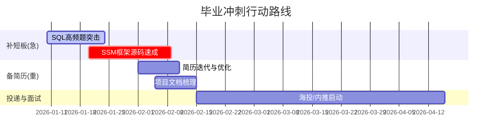

# 职业成长规划 Skill

将本 Skill 作为职业辅导系统的最终交付端，采用“诊断-规划一体化”策略：优先复用 job-match skill的诊断结果，如果没有可先调用job-match skill 进行输出,再生成可执行的成长路线图与报告。

## Inputs and Sources

- 优先使用 job-match skill 输出
  - `workspace/job_match/case_[姓名]_[目标岗位]/output/report.md`
  - `workspace/job_match/case_[姓名]_[目标岗位]/analysis/gap_matrix.md`
  - `workspace/job_match/case_[姓名]_[目标岗位]/analysis/match_results.json`（若存在）
- 当 job-match 输出缺失时，使用以下原始数据
  - 学生成绩单（如 `职业匹配/中等生-大四.docx`）
  - 职业/专业知识图谱（如 `职业匹配/前端工程师技能树（带课程）.docx` 或 `职业匹配/计算机专业知识图谱.docx`）

## Workflow

### Step 1: Create Case Folder

在 `workspace/career_growth/` 下创建 case：
`workspace/career_growth/case_[姓名]_[目标岗位]/`

推荐结构：

```
case_xxx/
├── input/
├── analysis/
├── draft/
└── output/
```

### Step 2: Intelligent Diagnosis (依赖检查与诊断)

优先检查并复用 job-match 输出：

- Scenario A（有 job-match）：提取
  - 总匹配度（Total）
  - “B级风险”和“C级缺失”项
  - 关键优势与短板描述
  - 输出 `analysis/diagnosis_summary.md`
- Scenario B（无 job-match）：基于成绩单与职业图谱快速诊断
  - 识别核心课程低分（<70）与未修/不及格项
  - 低分核心课 → 标记为“B级风险”
  - 未修或不及格核心课 → 标记为“C级缺失”
  - 生成临时 `analysis/diagnosis_summary.md`，标注“自动诊断（缺少 job-match 输出）”

### Step 3: Phase & Strategy Definition (阶段与策略定义)

读取年级，定义“时间紧迫系数”与口吻：

- 大一/大二（探索期 - Low）：采用广度优先，聚焦数学/英语基础、社团资源、兴趣探索；语气鼓励、允许试错。
- 大三（提升期 - Medium）：采用深度优先，聚焦项目实战、专业课绩点、实习准备；语气聚焦、强调作品沉淀。
- 大四（冲刺期 - High）：采用结果优先，聚焦面试技巧、速成补短板、简历优化、就业/考研二选一；语气务实、强调补救。

### Step 4: Gap-to-Resource Mapping (差距-资源映射)

将 Step 2 的问题项与 Step 3 的时间紧迫系数组合，输出可执行“药方”：

- C级缺失：安排“短期密集补足”任务（课程补修/速成专题/项目补强）
- B级风险：安排“中期稳固提升”任务（题库训练/案例复盘/课程强化）
- 优势项：安排“对外展示与放大”任务（作品集包装/竞赛/实习展示）

输出 `analysis/action_plan.md`，按“补短板(急)/强优势(稳)/项目与实习/简历与面试”分组。

### Step 5: Report Generation (综合报告生成)

生成 `draft/report.md`，最终输出 `output/report.md`。若 Step 2 为 Scenario B，报告头部必须包含“诊断摘要”章节。

报告至少包含：

1. 核心诊断摘要（仅在缺少 job-match 输出时完整呈现）
2. 阶段定位与策略（当前阶段与核心策略）
3. 成长路线图（Mermaid Gantt）
4. 重点行动清单（按紧迫度分组）
5. 风险提示与资源建议（课程/项目/实习/面试）

Mermaid Gantt 示例：



### Step 6: Quality Checks

- 确认 job-match 输出路径与目标岗位一致，避免错配
- 明确诊断依据（job-match 复用或自动诊断），避免“无数据推断”
- 时间轴长度与年级紧迫度一致（大四短期密集，大一/二更长周期）
